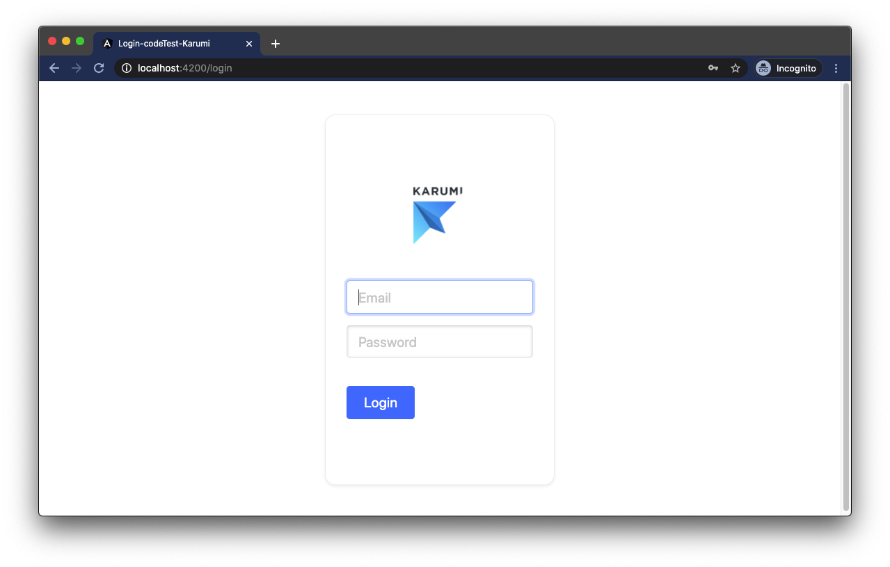

[](https://codecov.io/gh/patriciaSR/login-code-test)


# Login Code Test Project

A simple login application with user session storage



## Table of Contents

- [Project's goal](#projects-goal)
- [Getting Started](#getting-started)
  * [Prerequisites](#prerequisites)
  * [Installation](#installation)
- [Run the app](#run-the-app)
  * [Server](#server)
  * [Client](#client)
- [Testing](#testing)
  * [Server](#server-1)
  * [Client](#client-1)
- [Contributing](#contributing)
  * [Branch model](#branch-model)
  * [Pull requests & GitHub Actions](#pull-requests---github-actions)

## Project's goal

We want to implement a signin platform to log in with email and password into the platform. This log in process will generate a session token which should be persisted into the application so the user doesn’t have to login when opening the app again. Once the user is logged in, we can see a personal welcome message with his username and a button to logout and close user session.

## Getting Started

### Prerequisites

You will need to have installed `Node.js` and `npm` before install the project:
- [Node.js](https://nodejs.org/) version `>=12`
- [npm](npmjs.com)

### Installation

Clone the repository and install all dependencies (both of the `client` and the `server` apps):

```bash
# clone the repository
git clone https://github.com/patriciaSR/login-code-test.git
cd login-code-test

# Install client dependencies
cd client
npm install

# Install server dependencies
cd ../server
npm install
```

## Run the app

To be able to authenticate in the app use the following credentials:
- **email**: hello@email.com
- **password**: hello1234

### Server

The server is made using [express.js](https://expressjs.com/). Currently it only has two endpoints that handless the user session:

- **[POST] /auth**: returns the session token if credentials are valid.
- **[DELETE] /auth/:token**: deletes the token and kills the session.

> Currently returning fixtures

Before running the client, you must **run the server** in a terminal. From the `server/` directory run:

```bash
npm run start
```

Now the server is running on port [https://localhost:3000](http://localhost:3000).

### Client

The client is made using [Angular](https://angular.io/).

You need to **run the client app** in a different terminal. From the `client/` directory run:

```bash
npm run start
```

The client is running on port [http://localhost:4200](http://localhost:4200).

## Testing

This project has different test suites and tools for both of the back and the client apps.

### Server

To test the server, a fake HTTP server is created using [supertest](https://github.com/visionmedia/supertest). This allows to test the diferent endpoints without having network issues.

To run the test suite and generate coverage report run the next command within `server` directory:

```bash
npm run test

# development mode (watching file changes)
npm run test:watch
```

After the tests are finished, a coverage report is created in `server/coverage/`.

### Client

To test the entire client application run the next command within `client` directory:

```bash
npm run test
```

This command runs the unit test suite using [jest](https://jestjs.io/docs/en/getting-started) and also *end to end* (aka. e2e) tests using [cypress](https://www.cypress.io/) and [cucumber](https://cucumber.io/) to use *Behavior Driven Development* (BDD).

```bash
npm run test

# development mode for unit tests
npm run test:unit:watch

# development mode for e2e tests
npm run test:e2e:watch
```

After the tests are finished, a coverage report is created in `client/coverage/` for unit tests and `client/e2e/cypress/reports` for e2e tests.

> There are more available test commands that can be found in `client/package.json`.

## Contributing

**This repository is fully automated to run linters and tests before pushing code to remote repository**. This is powered by [husky](https://www.npmjs.com/package/husky).

Ensure you accomplish all this requirements before opening a pull request:

- **Commits**: ensure you meet the [conventional commit format](https://conventionalcommits.org/). This is powered by [commitlint](https://github.com/conventional-changelog/commitlint).
- **Code style**: This is powered by [eslint recommended rules](https://eslint.org/).
- **Tests**: All test suites (client and server) are run on each push.

### Branch model

Please contribute using [Github Flow](https://guides.github.com/introduction/flow/) and openning a pull request to `master` branch. This repository only use a integration branch called `master`.

### Pull requests & GitHub Actions

When openning a pull request, the workflow `.github/workflows/main.yml` is executed to check all requirenments and ensure that both of the apps works by running their tests.

This workflow runs (in order) the next steps:

- Setup an Ubuntu machine
- Clone repository and checkout to pull request branch
- Install Node.js
- Install client and server dependencies
- Run server linters and tests
- Run client linters and tests
- Upload [coverage reports to codecov](https://codecov.io/gh/patriciaSR/login-code-test)
